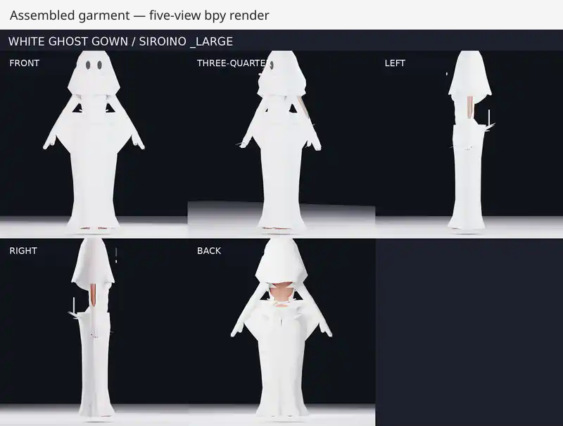

# White Ghost Gown for Siroino _Large

Target: **Siroino `_Large`**.

Current candidate state: **REJECTED — do not mark the PR ready for review yet.**

## Reference

Two private user-uploaded views are bound by SHA-256. The source images are not redistributed and no manufacturer, SKU, JAN, or commercial model number is asserted.

## Construction trial

- explicit 2D pattern contract
- Blender `bpy` pattern-layout render before assembly
- fitted white bodice, long sleeves, wrist drapes, ghost hood and back lacing
- lower center-back skirt seam closed using Blender Cloth sewing springs
- assembled five-view and pose rendering

## Review evidence

The review previews below are recompressed display derivatives of the hosted Blender artifact. They are committed so the branch and PR remain visually reviewable without downloading an Actions artifact.

### Pattern layout

### Sewn / assembled result

The full-resolution run artifact was produced by hosted Blender run `32472346811` from source commit `3ad893e81f4cf9f60fe58a4687a7b6d65bf2f4bf`.

## Current rejection reasons

The Blender build report has `passed: false`. Direct image inspection also rejects this iteration.

- `degenerateTriangles = 116`
- upper-body side panels are angular and do not match the reference silhouette
- forearms are exposed where the reference uses long fitted sleeves
- wrist drapes are too small/rigid compared with the large hanging sheets in the reference
- center-back skirt sewing produces folded/spiky artifacts
- arms-up / arm-cross evidence shows severe triangular deformation

See `Evidence/Build/product-build-report.json` for the measured evidence.

The next iteration must correct these defects, regenerate the same evidence, and only then create a passing `visual-review.json`.
